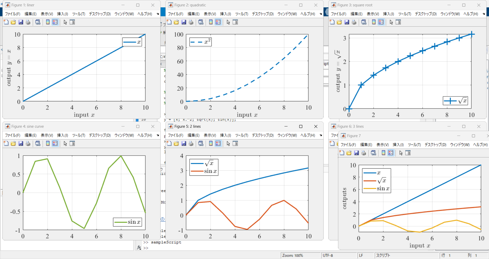

# arrange and resize figures

[](https://jp.mathworks.com/matlabcentral/fileexchange/158051-arrange-resize-figures)

This MATLAB function script arranges and resizes figures on the grid to fit your monitor.

 

It has the following features.
- Arrange figures on the grid according to the given vertical and horizontal numbers.
- Excess figures are stacked slightly off from the last figure position.
- The font size, line width, and marker size are resized according to the figure's width.
- These figures can be exported into PDF format.
- The exported figures conforms to IEEE format as default.


## Installation

There are two ways.
- Open [Add-On Explorer](https://jp.mathworks.com/help/matlab/matlab_env/get-add-ons.html) on your MATLAB and Search `arrange and resize figures`, then `Add` -> `Add to MATLAB`.
- Download from [](https://jp.mathworks.com/matlabcentral/fileexchange/158051-arrange-resize-figures), then copy `arrangeResizeFigures.mlx` into your workspace or [addpath](https://jp.mathworks.com/help/matlab/ref/addpath.html) in your MATLAB.


## Usage

There are no arguments that must be set.
The command is only `>> arrangeResizeFigures` or `>> arrangeResizeFigures()`.


### Option settings

It can be executed with the following options (default values in parentheses).

- `FigureNumbers` (All figures) : List of figure Numbers to be applied this function to.
- `Division` ([3, 2]) : Number of horizontal and vertical divisions.
- `PositionMargin` ([0, 50, 0, 25]) : Margins of a set of figures and between each figure.
- `Monitor` (1) : Monitor number to display.
- `ExportDir` ("Display only") : Save figures into ExportDir, if ExportDir is not "Display only".
- `ExportParams` : Parameters of exported figures.
    The currently supported parameters are as follows.
    Default value conforms to [IEEE two-column format](https://journals.ieeeauthorcenter.ieee.org/create-your-ieee-journal-article/create-graphics-for-your-article/file-formatting/).
    - `WidthInches` (3.5)
    - `FontSize` (10.0)
    - `FontName` ("Times New Roman")
    - `LineWidth` (1.5)
    - `MarkerSize` (10)

If you have any requests, please contact us via [GitHub issues](https://github.com/kimushun1101/arrange-resize-figures/issues).


### Command examples

After preparing some figures, run the following command or script.
A sample script including preparation is [sampleScript.m](https://github.com/kimushun1101/arrange-resize-figures/blob/main/sampleScript.m).

Basic
```
arrangeResizeFigures
% or
% arrangeResizeFigures()
```
Only the specified figures; see [Tips](#tips)
```
arrangeResizeFigures(FigureNumbers=[2, 4, 6])
```
Numbers of screen divisions : [horizontal, vertical]
```
arrangeResizeFigures(Division=[4,3])
```
Margins of a set of figures and between each figure : [left bottom width height]
```
arrangeResizeFigures(PositionMargin=[50, 100, 25, 50])
```
Monitor to be displayed
```
arrangeResizeFigures(Monitor=2)
```
Directory name of the export destination; see [Tips](#tips)
```
arrangeResizeFigures(ExportDir='fig')
```
Set Parameters of exported figures
```
params.LineWidth = 5;
params.MarkerSize = 30;
arrangeResizeFigures(ExportParams=params)
```
Multiple of the above settings are made at the same time. It is also possible to give some of them.
```
arrangeResizeFigures(FigureNumbers=figNums, Division=[4,3], PositionMargin=[50, 100, 25, 50], Monitor=2, ExportDir='fig', ExportParams=params)
```


## Tips

- If you add a figure name, the file name will be used when the figure is exported to PDF format.
    ```
    figure(Name='liner')
    ```
    Otherwise, the file name will be "Figure" + figure.Number.
- To expose LiveScript figures outside, set the 'Visible' parameter to 'on'.
    ```
    figure(Name='liner', Visible='on')
    ```
- The following command helps us to find figure numbers.
    ```
    findall(0,'Type','figure')
    % arrangeResizeFigures(FigureNumbers=[2, 4, 6])
    ```


## License

The MIT License
